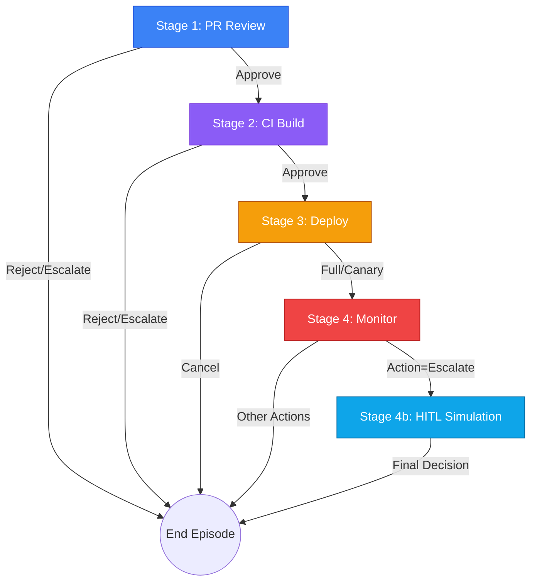
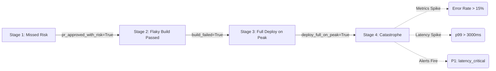

# DevOps Release Commander (OpenEnv)

On October 4, 2021, a BGP configuration update at Facebook took
down Facebook, Instagram, and WhatsApp for six hours. Engineers
who could fix it couldn't get in — their own automated pipeline
had locked them out.

In 2016, one developer removed an 11-line npm package called
left-pad. Hundreds of production builds broke in minutes.
React, Babel, and Node.js all failed.

These weren't code bugs. They were release pipeline failures —
moments where an AI agent with the right training could have
caught the problem before it reached production.

**The DevOps Release Commander is that agent's training ground.**

## What Makes This Environment Unique

### Pipeline State Propagation

Bad decisions at early stages create **observable consequences** at later stages. Approve a risky PR at Stage 1 → cascading error rate spikes and latency inflation at Stage 4. The agent never learns *why* metrics are bad — it must learn to prevent cascading failures.

### Human-in-the-Loop (HITL) Simulation — Stage 4b

When an agent escalates (action=3) at Stage 3 or 4 in Hard+ scenarios,
the environment does NOT terminate. Instead it injects a synthetic
on-call SRE response into the observation. The agent must then decide
whether to follow the expert or override — testing judgment under
authority, not just pattern matching. No other OpenEnv environment has this.

---

## 1. Architecture Flow



---

## 2. Environment Design

### Observation Space

| Field | Type | Range / Values | Description |
|---|---|---|---|
| `stage` | integer/string | 1, 2, 3, 4, "4b" | Current pipeline stage |
| `difficulty` | integer | 1–4 | 1=Easy, 2=Medium, 3=Hard, 4=Nightmare |
| `episode_id` | string | — | Unique episode identifier |
| `pr_title` | string | — | Pull request title |
| `pr_diff_summary` | string | — | Summary of code changes |
| `pr_files_changed` | integer | 0+ | Number of files modified |
| `author_trust_score` | float | [0.01, 0.99] | Historical trust metric for PR author |
| `has_tests` | boolean | — | Whether PR includes test coverage |
| `build_status` | string | passing/failing/flaky/pending | CI build result |
| `tests_passed` | integer | 0+ | Number of passing tests |
| `tests_failed` | integer | 0+ | Number of failing tests |
| `coverage_pct` | float | [0.01, 99.99] | Code coverage percentage |
| `deploy_environment` | string | staging/production | Target deployment environment |
| `traffic_level_pct` | float | [0.01, 99.99] | Current traffic as % of peak |
| `rollout_strategy` | string | full/canary/blue_green | Deployment strategy |
| `error_rate_pct` | float | [0.01, 99.99] | Production error rate |
| `latency_p99_ms` | float | 0+ | 99th percentile latency in ms |
| `cpu_pct` | float | [0.01, 99.99] | CPU utilisation percentage |
| `active_alerts` | list[string] | — | Active monitoring alerts (P1 = critical) |
| `sre_response` | string (optional) | — | SRE response (Stage 4b only) |

### Action Space

| Action | Stage 1 (PR) | Stage 2 (Build) | Stage 3 (Deploy) | Stage 4 (Monitor) | Stage 4b (HITL) |
|---|---|---|---|---|---|
| **0** | Approve PR | Approve Build | Full Deploy | All Clear | Follow SRE |
| **1** | Reject PR | Block Build | Cancel Deploy | Rollback | Emergency Rollback |
| **2** | Request Changes | Re-run Tests | Canary Deploy | Reduce Traffic | Reduce Traffic |
| **3** | Escalate to Lead | Escalate to DevOps | Page On-Call | Page SRE | Escalate Further |

### Reward Function

The reward is computed from 5 components per stage:

| Component | Max Value | Condition |
|---|---|---|
| **Classify Correct** | +0.10 | Correctly identifies the situation type |
| **Risk Aware** | +0.10 | Correctly identifies presence/absence of risk |
| **Optimal Action** | +0.15 | Selects the single best action for current context |
| **Recovery Bonus** | +0.15 | Recovers from prior bad decision at Stage 4 |
| **Speed Bonus** | +0.05 | Direct rollback on P1 alert (no escalation first) |

**Catastrophic Condition:** Choosing action=0 at Stage 4 when `active_alerts` contains any "P1" alert → **immediate minimum reward (0.01)**.

All rewards are strictly clamped to **[0.01, 0.99]** — boundary values are excluded.

### Pipeline State Propagation

This is the core novel mechanic. Bad decisions at early stages create **observable consequences** at later stages:

```
Stage 1: Approve risky PR → pr_approved_with_risk = True
                ↓
Stage 2: Approve failing build → build_failed = True
                ↓
Stage 3: Full deploy at peak traffic → deploy_was_full_on_peak = True
                ↓
Stage 4: Observation now shows:
         • Elevated error_rate_pct (+2-5% from peak deploy)
         • Inflated latency_p99_ms (×1.5-3.0 from peak)
         • Additional alerts: "high_traffic_error_spike", "build_issue_in_production"
```



---

## 3. The 14 Training Scenarios

| ID | Difficulty | Name | Key Challenge | Optimal Path |
|---|---|---|---|---|
| **S01** | 1 (Easy) | Clean Green PR | Standard expected flow | S1:Approve → S4:Proceed |
| **S02** | 1 (Easy) | SQL Injection | Suspicious code in diff | S1:Reject |
| **S03** | 2 (Medium) | Flaky Test False Alarm | Tests failed but overall score is high | S2:Re-run |
| **S04** | 2 (Medium) | Off-by-one Bug | PR looks okay but CI fails heavily | S2:Block |
| **S05** | 2 (Medium) | Peak Traffic Deploy | Huge traffic level requires cautious rollout | S3:Canary |
| **S06** | 3 (Hard) | Malicious Dependency | Trusted author, but contains backdoor | S1:Reject |
| **S07** | 3 (Hard) | Memory Leak | Fails silently in CI, spikes latency in Prod | S4:Rollback / Escalate |
| **S08** | 3 (Hard) | Silent Vulnerability | Low entropy token gen, flags security | S4b:Rollback |
| **S09** | 4 (Nightmare)| The Full Storm | DB full table scans, highest error rate | S4:Emergency Stop |
| **S10** | 4 (Nightmare)| The Traitor | Ghost metrics and exfiltration | S4b:Rollback |
| **S11** | 4 (Nightmare)| Deceptive Hotfix | Multi-step memory: missed DB migration + evasive `eval()` | S1:Reject *or* S4b:Rollback |
| **S12** | 2 (Medium) | Infrastructure Drift | Config change deployed at peak traffic | S3:Canary |
| **S13** | 3 (Hard) | Database Schema Lock | Clean code but crashes DB connections in prod | S4b:Rollback |
| **S14** | 4 (Nightmare) | AI-Hallucinated PR | Metagame trap: "AI-generated" PR with bypassed edge cases | S1:Reject |

---

## 4. The Five Tasks

### Task 1: PR Triage (Easy, Stage 1 only)
- **Scenarios:** S01 (Clean Green PR), S02 (SQL Injection)
- **Challenge:** Distinguish clean PRs from security threats

### Task 2: Build Gate (Medium, Stages 1–2)
- **Scenarios:** S03 (Flaky Test False Alarm), S04 (Off-by-one Bug),
  S05 (Peak Traffic Deploy)
- **Challenge:** Differentiate known-flaky tests from real failures

### Task 3: Full Release (Hard, Stages 1–4 with HITL)
- **Scenarios:** S06 (Malicious Dependency), S07 (Memory Leak),
  S08 (Silent Vulnerability)
- **Challenge:** Full lifecycle with cascading failures and SRE escalation

### Task 4: Nightmare Release (Difficulty 4, Stages 1–4 with HITL)
- **Scenarios:** S09 (The Full Storm), S10 (The Traitor)
- **Challenge:** Combined failure modes, deceptively high trust scores,
  multiple P1 alerts simultaneously

### Task 5: Deceptive Release (Difficulty 4, Stages 1–4 with HITL)
- **Scenarios:** S11 (Deceptive Hotfix)
- **Challenge:** Evaluates multi-step memory & detection of delayed catastrophic logic bombs

---

## 5. Human-in-the-Loop (HITL) Simulation

When the agent chooses **action=3 (Escalate)** at Stage 3 or 4
in Hard+ scenarios, the environment transitions to **Stage 4b**.

### What happens at Stage 4b

1. The observation includes all Stage 4 metrics plus an `sre_response` field
2. The `sre_response` contains a synthetic on-call SRE's assessment
3. The agent must decide whether to follow or override the SRE recommendation
4. Overriding good SRE advice = minimum points for the optimal_action component

### Example Stage 4b observation
```json
{
  "stage": "4b",
  "difficulty": 3,
  "error_rate_pct": 2.45,
  "cpu_pct": 87.3,
  "latency_p99_ms": 1423.7,
  "active_alerts": ["high_memory_usage", "P1: latency_degradation"],
  "sre_response": "SRE: Confirmed memory leak in auth service.
                   Recommend immediate rollback."
}
```

The optimal action here is **1 (Rollback)** — following the SRE advice.

---

## 6. Setup Instructions

### Docker (Recommended)
```bash
docker build -t devops-release-commander .
docker run -p 7860:7860 devops-release-commander
open http://localhost:7860
```

### Environment Variables (for inference.py)
```bash
export API_BASE_URL="https://router.huggingface.co/v1"
export MODEL_NAME="meta-llama/Llama-3.3-70B-Instruct"
export HF_TOKEN="hf_your_token_here"
```

### Local Development
```bash
pip install -r requirements.txt
uvicorn main:app --host 0.0.0.0 --port 7860 --reload
python3 tests/test_grader.py
python3 inference.py
```

---

## 7. API Usage

### GET|POST /reset
```bash
# GET
curl "http://localhost:7860/reset?difficulty=3&seed=42"

# POST
curl -X POST "http://localhost:7860/reset" \
  -H "Content-Type: application/json" \
  -d '{"difficulty": 3, "seed": 42}'
```

### GET /state
```bash
curl "http://localhost:7860/state"
```

### POST /step
```bash
curl -X POST "http://localhost:7860/step" \
  -H "Content-Type: application/json" \
  -d '{"action": 1, "reason": "SQL injection detected in diff"}'
```

**Response:**
```json
{
  "observation": {"stage": 1, "difficulty": 1},
  "reward": 0.70,
  "done": true,
  "info": {}
}
```

### GET / — Demo UI
```bash
open http://localhost:7860
```
> **Cinematic Intelligence Dashboard:** Dark-mode glassmorphic interface with a Live Telemetry Chart (Chart.js) graphing CPU and Latency sequentially across the pipeline, and a Typewriter Engine that renders the LLM's reasoning step-by-step.

### GET /health
```bash
curl "http://localhost:7860/health"
```

---

## 8. Baseline Benchmark Results

Evaluated locally with `seed=42` across 5 tasks.

| Model | Size | Total Reward | Score % | Catastrophic Failures | Time |
|---|---|---|---|---|---|
| **Llama-3.3 (Groq)** | 70B | 3.33 / 5.0 | 66.6% | 0 | 1.8s |
| **Gemma 3** | 12B | 3.24 / 5.0 | 64.8% | 0 | 78.6s |
| **Qwen 2.5** | 14B | 1.27 / 5.0 | 25.4% | 1 (Stage 2 Blocked) | 277.5s |

> The variance in results proves the environment is highly discriminative. Smaller models tend to instinctually "Approve" (Action 0) without considering catastrophic cascading state, while larger models successfully detect security traps and reject them instantly.

---

## 9. Compliance Checklist

- [x] **step/reset/state API** — All three endpoints present
- [x] **Reward range [0.01, 0.99]** — All rewards strictly clamped, boundary values excluded
- [x] **Observation bounds** — All bounded fields clamped in `_generate_observation()` via universal safety clamp
- [x] **info = {} always** — Zero leakage through info dict
- [x] **step() never crashes** — Full try/except wrapping, returns 0.01 on error
- [x] **Deterministic with seed** — `self.rng = random.Random(seed)` in reset()
- [x] **openenv.yaml** — 5 tasks, `score_range: [0.01, 0.99]`, `spec_version: 1`
- [x] **baseline_script** — `inference.py` with OpenAI client, env var config
- [x] **server.app:main** — Functional entry point with deterministic baseline policy
- [x] **Grader variance** — All 14 scenarios show reward variance across 4 actions
- [x] **Pipeline State Propagation** — Verified cascading state effects
- [x] **HITL Simulation** — Stage 4b with `sre_response`
- [x] **[START]/[STEP]/[END] logging** — Strict format in both `inference.py` and `server/app.py`
- [x] **Multi-model validation** — Benchmarked across `llama-3.3-70b`, `gemma3:12b`, `qwen:14b`